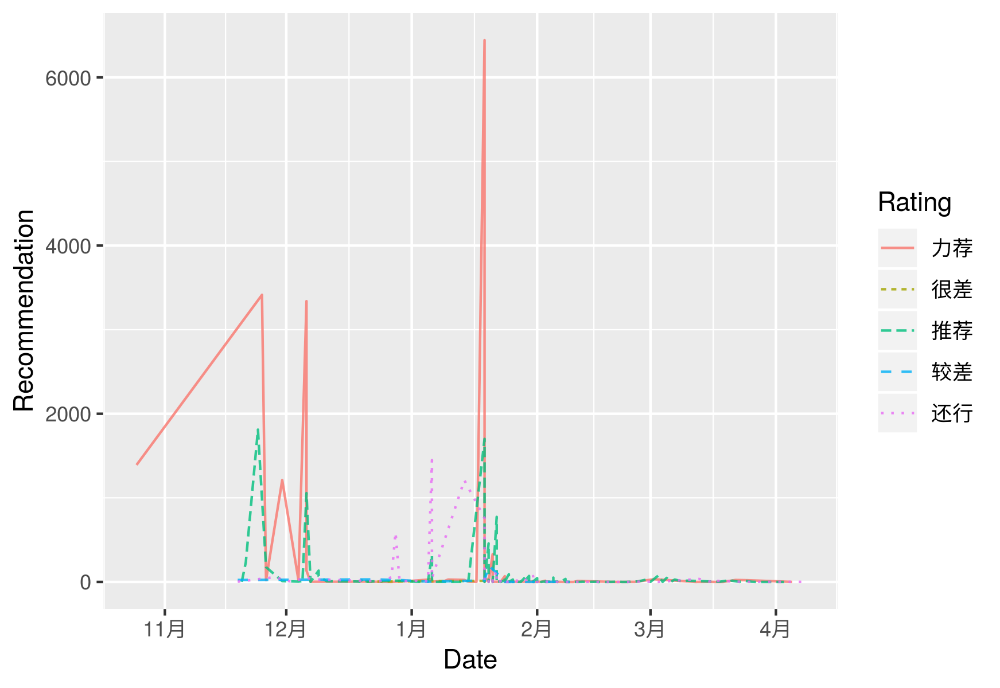

### EDA——影评分析

#### 数据集说明

数据是之前自己爬的《奇迹男孩》的豆瓣影评，共500条记录，每条包含6个字段，分别为：评论人的ID，评论人主页链接，评论时间（时间，日期），评论内容，总体评价（很差，较差，还行，推荐，力荐），获得的点赞数。

> 只爬了500条是因为豆瓣目前最多只能看到500条影评信息，即使在浏览器也是如此。如果不登录的话，最多只能获取200条信息。

这里我们主要对评论内容和总体评价进行分析。

#### 分析流程

分析的核心代码为`EDA.R`, 此外也在`Jupyter notebook`写了一遍，加上了下面各图的解释说明，以及各种描述统计量的计算等， 具体见[EDA.ipynb](https://nbviewer.jupyter.org/github/shenxiangzhuang/SysuDMCourse/blob/master/EDA/EDA.ipynb)。以下图片均来自`pics`文件夹（供做课件）。

##### 评论字数的分析

```

```


##### 词云


##### 点赞趋势的分析

